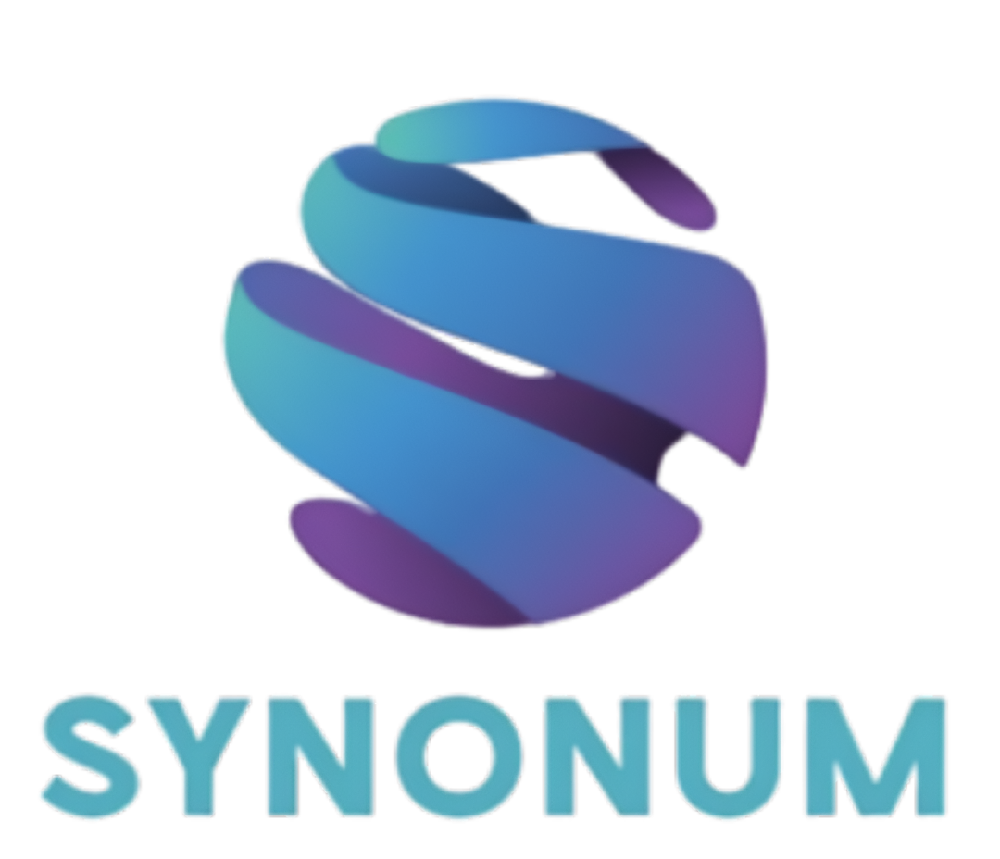

<h1 align="center"> Synonum </h1>

<h2 align="center"> ✨ Our Project ✨ </h2>

Our project offers a set of fun, simple math and word games that challenge your thinking while staying easy to pick up and play. Each game is designed to be engaging, replayable, and enjoyable for players of all ages.

 

<h2> 🌟 Why you should choose us: </h2>

<ul font-size="30px">
    <li> Many options to choose from </li>
    <li> Fun game </li>
    <li> Fast and easy connection </li>
    <li> Good feedback </li>
    <li> Original and clever ideas </li>  
</ul>

<h2> 💻 Softwares and Programmes we used : </h2>

 

<h2> 💫 Our Team : 
 

 
| **Person** | **Job** | **Class** |
| :---:   | :---: | :---: |
| Radostin Dimkirichev | Front-end Developer | 9th "A" |
| Mariela Apostolova | Back end developer  | 9th "B" |
| Vsevolod Bolotov | Front-end Developer  | 9th "V" |
| Dimana Foteva |  Scrum trainer  | 9th "G" |
